# 表演場地管理系統 — 系統介紹報告

> 課程：網際網路資料庫（2023）
> 本報告以實際操作畫面呈現系統的主要使用流程。
> 部分含有真實個資的畫面（會員管理、登入後個別使用者主頁）已被排除，
> 系統的對應功能仍在文字中說明。

---

## 1. 系統定位與使用者類型

本系統提供「表演場地」的線上預約與「觀眾席座位」的線上劃位，依使用者身分區分功能：

| 使用者類型 | 主要任務 | 系統提供 |
|-----------|---------|---------|
| **系統管理員** | 維運與監督 | 會員管理、場地預約管理、劃位預約管理 |
| **表演團體** | 借用場地 | 場地預約、查詢場地空檔、成功後收 Email |
| **顧客** | 觀賞演出 | 線上劃位、查詢場地、成功後收 Email |

實作上資料庫的 `role` 欄位只區分 `admin` 與 `user` 兩值，「表演團體」與「顧客」在權限上相同，皆走 `user` 流程。

---

## 2. 註冊與登入

### 2.1 註冊帳號

新使用者透過 `Register.aspx` 建立帳號，需要填入使用者名稱、帳號、密碼、確認密碼、Email。註冊成功後，資料寫入 `Data` 資料表，預設 `role = user`，主鍵 `Num` 由系統自動取「目前筆數 + 1」。

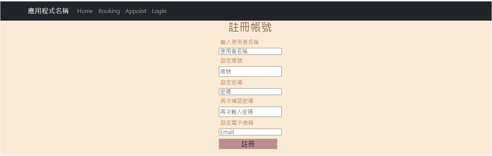

### 2.2 使用者登入

`Login.aspx` 以帳號 + 密碼比對 `Data` 資料表。登入成功後系統會：
- 設定 `Session["LoggedIn"] = true`
- 設定 `Session["Username"]` 與 `Session["Account"]`
- 透過 `FormsAuthentication.SetAuthCookie` 簽發驗證 Cookie
- 重新導向至 `Main.aspx`

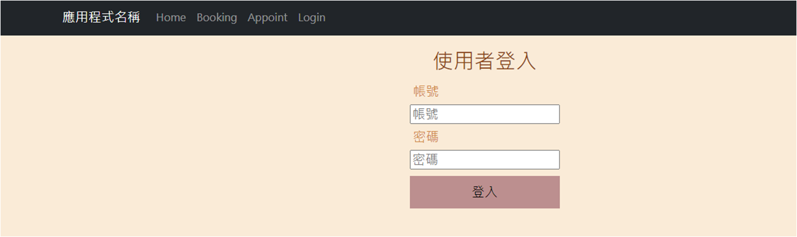

---

## 3. 主頁（Main.aspx）

### 3.1 未登入狀態

未登入時主頁僅顯示「點此登入」按鈕，所有功能入口隱藏。

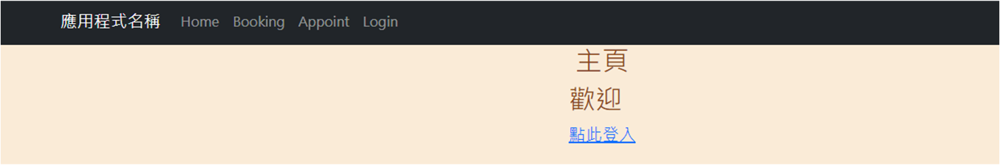

### 3.2 一般使用者登入後

`Main.aspx.cs` 在 `GetUserRole` 中將資料庫的 `admin` 重新映射為「管理員」、其他映射為「一般使用者」做為顯示文字。一般使用者登入後可看到「進入預約系統」「進入劃位系統」兩個入口；不會看到管理員專屬的 `Membership` / `ManageApp` 連結。

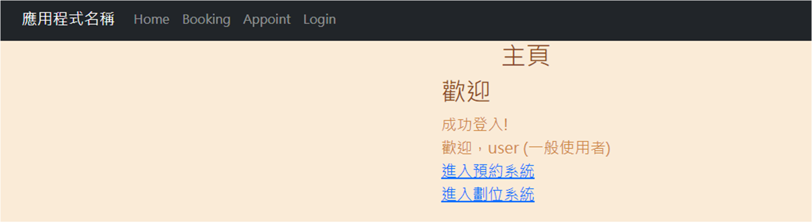

### 3.3 管理員登入後（畫面省略）

> 此畫面內含註冊時填入的真實姓名（受版面限制無法馬賽克），故本報告不貼。
>
> 與一般使用者畫面的差別：導覽列額外多出 **Membership** 與 **Manage App** 兩個連結，內容指向 `Membership.aspx` 與 `ManageApp.aspx`。

---

## 4. 表演場地預約（Booking.aspx）

### 4.1 預約功能

選擇場地、預訂日期、預訂時間後送出。系統會檢查該時段是否已被佔用，未佔用則寫入 `Booking.accdb` 的對應表，並透過 Gmail SMTP 寄送預約確認信至使用者 email。

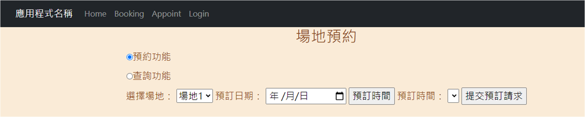

### 4.2 查詢功能

切換至「查詢功能」後可指定場地與日期區間，系統列出該區間內既有的預約紀錄，方便表演團體確認還有哪些空檔。

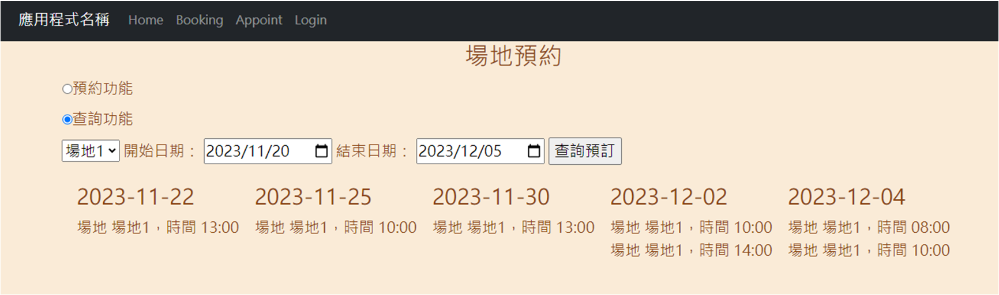

### 4.3 預約成功示範

下圖示範以「場地 1、2023/12/12、09:00」進行預約。畫面紅字顯示「已發送預訂資訊到您的信箱！」表示後端 SMTP 已成功送信。

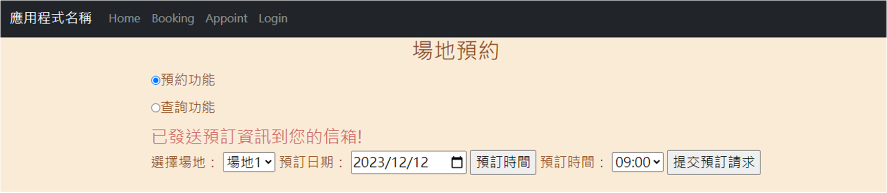

---

## 5. 線上劃位（Appoint.aspx）

劃位流程分三個階段，對應劃位系統需要處理的三個 UX 步驟。

### 5.1 選擇日期與場地

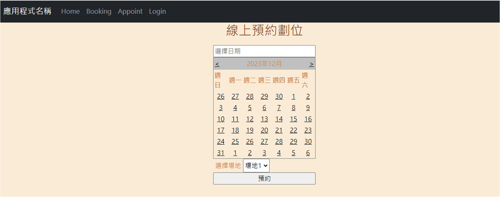

### 5.2 顯示座位狀態並選位

每個場地預設提供 49 個座位。已被劃走的座位以 **紅色** 標示且無法再點選；可選座位顯示為灰色按鈕。系統設計需考量「多人同時劃位」的競爭條件。

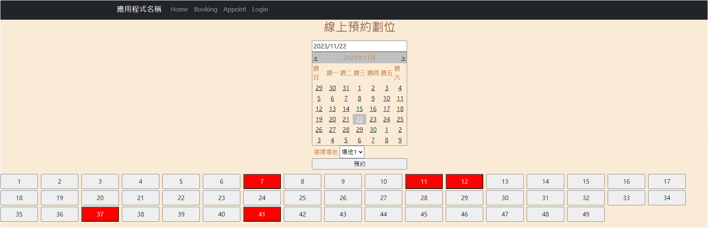

### 5.3 劃位成功

點擊可選座位後送出，系統將該座位狀態改為已劃位，畫面下方顯示「劃位成功！座位編號：44」並寄送通知信至使用者 email。下圖中可見座位 44 已轉為紅色。

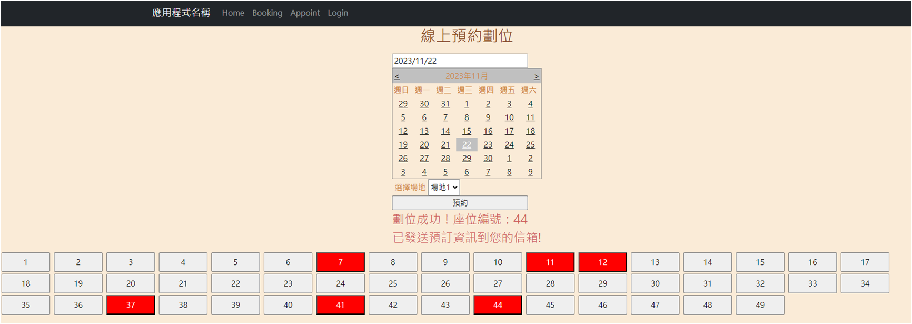

---

## 6. 管理員後台 — 預約管理（ManageApp.aspx）

管理員可進入「預約管理」頁面，看到目前所有的場地預約紀錄與劃位紀錄，並可逐筆刪除。畫面下方亦提供「新增場地預約」「新增劃位預約」表單，用於管理員主動建立預約（例如為線下訂位的使用者代為登錄）。

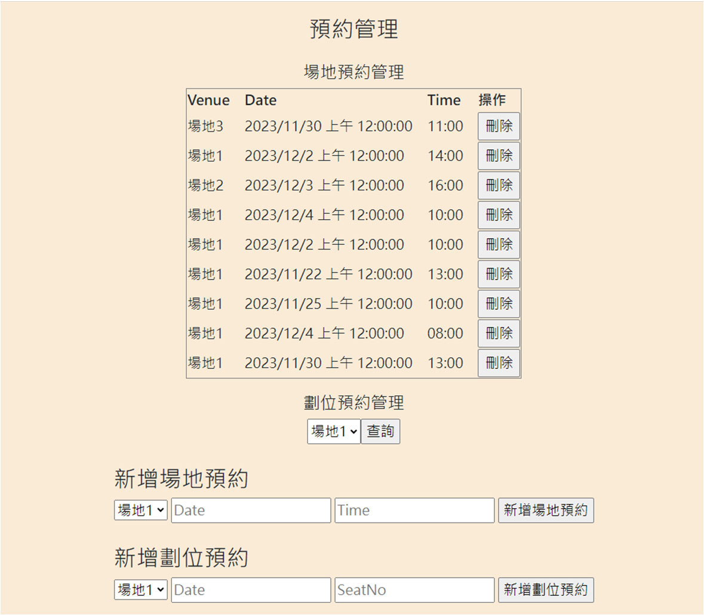

> ⚠️ 另一個管理員專用頁面 **會員管理（Membership.aspx）** 因為展示時必然會曝露真實使用者的帳號 / 密碼 / Email，本報告省略畫面。其功能為：
> - 列出所有 `Data` 資料表中的使用者（Account / Password / Username / Role / Email）
> - 對每筆提供「編輯」「刪除」按鈕
> - 提供「新增會員」表單

---

## 7. Email 通知機制

`Booking.aspx.cs` 與 `Appoint.aspx.cs` 在預約 / 劃位成功後使用 `System.Net.Mail.SmtpClient` 透過 Gmail SMTP（`smtp.gmail.com:587`、SSL）發送通知，主旨為「預訂通知」，內容含使用者名稱、場地、日期。

實際運作需要在程式碼中填入有效的 Gmail 寄件帳號與「應用程式密碼」，本 repo 預設為空字串以避免憑證外洩，使用方式請見 `README.md` 第 4 步。

---

## 8. 資料表結構摘要

| 資料庫 | 主要資料表 | 欄位 |
|--------|-----------|------|
| `Data.accdb` | `Data` | Num（PK）、account、password、username、role、email |
| `Booking.accdb` | 場地預約表、劃位預約表 | Venue、Date、Time、SeatNo 等 |

---

## 9. 已知限制

本系統為 2023 年課程作業，受限於課程目標與時程，下列議題未在本作業範圍內處理，列出供日後改善參考：

1. **明文密碼**：`password` 以明文存放，未做雜湊。改善方向：採用 PBKDF2 / bcrypt / Argon2。
2. **SQL Injection 風險**：部分查詢以字串拼接，例如 `Login.aspx.cs` 的 `WHERE account = '" + AC + "'`。改善方向：一律改為參數化查詢。
3. **連線字串硬編碼**：`D:\Database\` 寫死在多處 `.cs`，部署彈性低。改善方向：移至 `Web.config` 的 `<connectionStrings>`。
4. **無 CSRF / HTTPS 防護**：敏感操作建議加上 AntiForgeryToken 並強制 HTTPS。
5. **劃位並發控制**：題目要求考量多人同時劃位，目前實作以「先寫先贏」處理，較完整的做法應使用交易（transaction）與資料列鎖。

---

> 本報告由原始碼、原作者繳交的說明文件與系統實際截圖整理。
